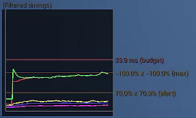
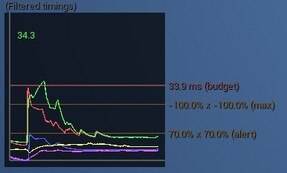
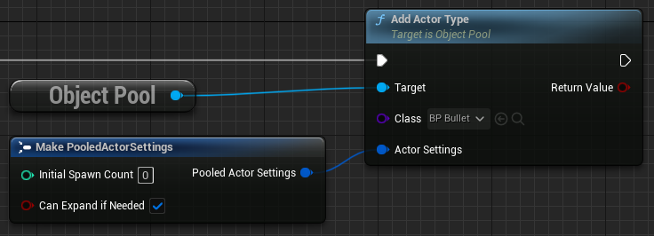
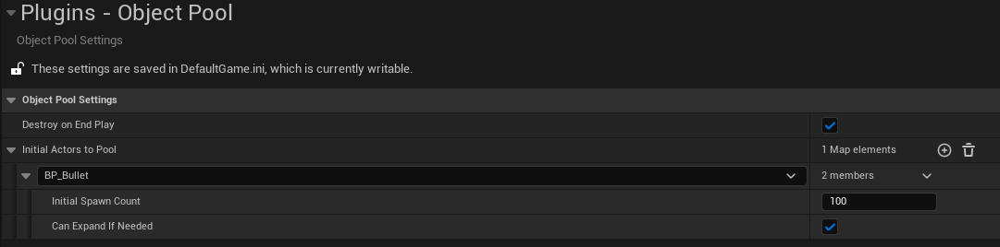
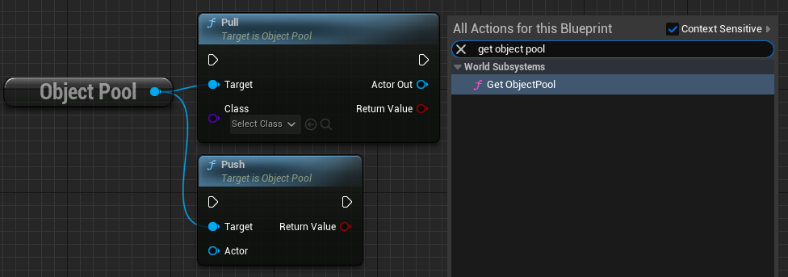
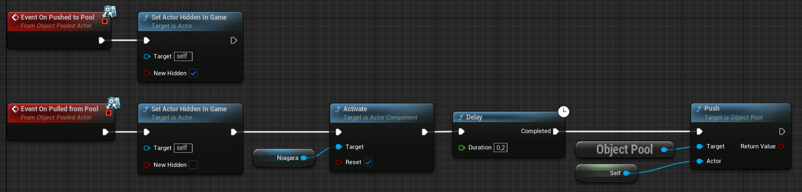


 
# UnrealEngine-ObjectPool 

This is a plugin for Unreal Engine 5 (Probably works in 4 as well) which provides an easy-to-use [Object Pool](https://en.wikipedia.org/wiki/Object_pool_pattern).

# Index
- [What](#what)
- [Why](#why)
- [Performance Example](#performance-example)
- [How](#how)
    - [Settings](#settings)
    - [Pool User](#pool-user)
    - [Pooled Actor](#pooled-actor)

# What

>[Wikipedia (Object pool pattern)](https://en.wikipedia.org/wiki/Object_pool_pattern) - The object pool pattern is a software creational design pattern that uses a set of initialised objects kept ready to use – a "pool" – rather than allocating and destroying them on demand. A client of the pool will request an object from the pool and perform operations on the returned object. When the client has finished, it returns the object to the pool rather than destroying it; this can be done manually or automatically.
>
>When it is necessary to work with numerous objects that are particularly expensive to instantiate and each object is only needed for a short period of time, the performance of an entire application may be adversely affected. An object pool design pattern may be deemed desirable in cases such as these.
>
>The object pool design pattern creates a set of objects that may be reused. When a new object is needed, it is requested from the pool. If a previously prepared object is available, it is returned immediately, avoiding the instantiation cost. If no objects are present in the pool, a new item is created and returned. When the object has been used and is no longer needed, it is returned to the pool, allowing it to be used again in the future without repeating the computationally expensive instantiation process. It is important to note that once an object has been used and returned, existing references will become invalid.
>
>Object pools are primarily used for performance: in some circumstances, object pools significantly improve performance. Object pools complicate object lifetime, as objects obtained from and returned to a pool are not actually created or destroyed at this time, and thus require care in implementation.

# Why
When spawning a lot of actors at a high rate or many instantly you often encounter lag spikes due to constructing so many new objects. This can be a huge problem for certain types of projects, a bullet hell for example. To combat this problem we can use an object pool pattern to spawn the actors beforehand, often when the level loads and then simply hide/unhide them when needed. Setting this up for many different kinds of actors can be annoying to manage depending on how you structure the system. 

That's why I created this plugin a couple of years ago and recently rewrote it to be a better version of it.

# Performance Example
> [!WARNING]  
> This is an extreme example with many actors spawning each frame. Take this with a full fist of salt since the performance gain is unique to every project.

> [!NOTE]  
> The **`GREEN`** graph represents the game thread which is responsible for this logic.

**In my test project I spawn 100 bullet actors each frame and then destroy them after 0.2 seconds.**

| **Normal spawning** | **Pooled + pre-spawn** | **Pooled + no pre-spawn** |
| --- | --- | --- |
| You can see a consistent performance hit due to constructing so many new objects. |   When using pooling with pre-spawning instead we se a big initial performance hit since we're spawning a lot of actors at the same time. But after that the only thing eating precious frame time is our general code which runs in both examples anyway.    |   When not pre-spawning any actors and letting the pool automatically expand with new actors as needed we can se a frame time which steadily moves down as it fills upp the pool and pulled actors dont have to be spawned.|
||||

# How
There's different ways to use the pool. You can let the pool automatically spawn your actors when you try to pull an actor and the pool is empty, or you can set a fixed amount of actors to pre-spawn and then have them ready, or a combination of them both. I recommend you pre-spawn an estimate of how many actors you're going to need at the same time and also allow it to expand automatically if needed. 

If you try to pull/push an actor to the pool which haven't been added, it will be added automatically with the default settings of spawning 0 extra actors and allowing expansion if needed. For this to work the actor still has to implement the interface.

> [!WARNING]  
> If you pre-spawn a lot of actors (above ~200) I highly recommend making sure you don't have a bunch of components auto activating on spawn. Especially sound or vfx. This can cause the game to freeze for a long time due to the sheer number of things activating at the same time.

### Settings
This can be done through code or by setting some defaults for the pool in the plugin settings.

The settings can be found in `Project Settings -> Plugins -> Object Pool`.

Add the actor class you want to pool and specify its settings.

## Pool user
For each world the engine automatically creates an object pool manager as an **UWorldSubsystem**. The lifetime is handled automatically, so you don't have to think about it. All you do is fetch a reference to the subsystem and use it. This can be any system which is responsible for pushing/pulling actors from the pool.

## Pooled actor
There's one basic requirement for any actor you want to pool. It has to implement the provided interface **"Object Pooled Actor"** which has some functions which the pool will call.

You need to decide what happens to an actor when its pushed/pulled from a pool. Often this would include disabling collision on the actor and hiding it. Here's an example of an actor that sets its visibility and activates it's niagara system when pulled. After a set time this actor will push itself to the pool again instead of destroying it. It can then be reused when something tries to pull an actor of that class from the pool.

